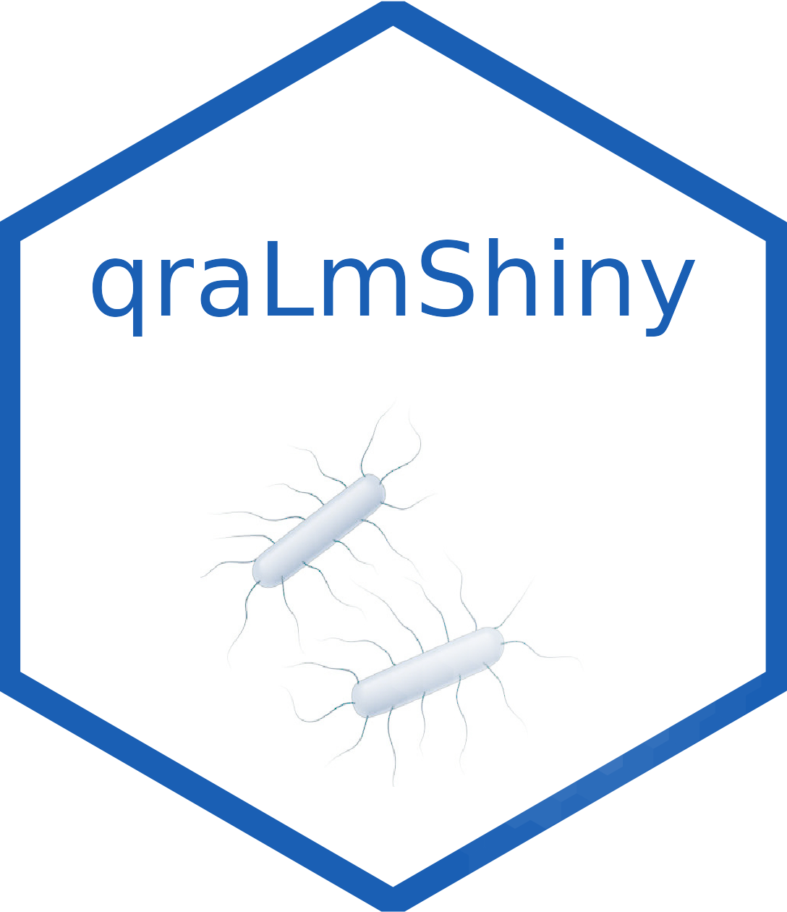

# qraLmShiny {width=15%}

## Table of Contents

- [qraLmShiny](#qraLmShiny)
  - [Table of Contents](#table-of-contents)
  - [Overview](#overview)
  - [Key Features](#key-features)
    - [Additional Features](#additional-features)
  - [Motivation](#motivation)
  - [Getting Started](#getting-started)
    - [Installation](#installation)
    - [Usage](#usage)
  - [Software Requirements](#software-requirements)
    - [Additional Libraries](#additional-libraries)
  - [Architecture Overview](#architecture-overview)
    - [Data (`data/`)](#data-data)
    - [Modules (`modules/`)](#modules-modules)
    - [Pages (`pages/`)](#pages-pages)
      - [About (`about/`)](#about-about)
      - [Models (`models/`)](#models-models)
    - [Web Assets (`www/`)](#web-assets-www)
    - [App Entry (`app.R`)](#app-entry-appr)
  - [High-Level Design and Low-Level Design](#high-level-design-and-low-level-design)
    - [High-Level Design](#high-level-design)
    - [Low-Level Design](#low-level-design)
    - [Directory Structure](#directory-structure)
  - [Data Dictionary](#data-dictionary)
    - [Key Data Fields](#key-data-fields)
    - [Models](#models)
  - [User Roles](#user-roles)
  - [FAQ](#faq)
  - [Contributing](#contributing)
  - [Collaborators](#collaborators)
  - [License](#license)
  - [Acknowledgments](#acknowledgments)

## qraLmShiny

Shiny application based on the [qraLm](https://vcadavez.github.io/qraLm/index.html) R package developed for the quantitative risk assessment of *L. monocytogenes* in Frozen Vegetables, Diced RTE Cantaloupe and Cold-smoked RTE Fish; under the scope of the [Joint FAO/WHO](https://www.who.int/publications/m/item/jemra-of-listeria-monocytogenes-in-foods)
 Expert meeting on microbiological risk assessment of Listeria monocytogenes in foods.

## Overview

The `qraLmShiny` application is a tool for simulation of quantitative risk assessment models for *Listeria monocytogenes* in foods, developed under the scope of the joint FAO/WHO Expert Meeting on Microbiological Risk Assessment of *Listeria monocytogenes* in foods.

*   [Summary Report](https://www.fao.org/3/cc6993en/cc6993en.pdf)

*   [Visit the GitHub Repository](https://github.com/vcadavez/qraLmShiny)

## Key Features

*   **Interactive Models**: Comprehensive risk assessment models for accurate insights.

*   **Fluid User Interface**: Navigate through interactive sections including Production, Cooking, Risk, and Testing.

*   **Reports & Resources**: Download detailed reports and access various resources.

*   **Libraries Used**: Developed using Shiny, and integrates popular R libraries like `dplyr`, `ggplot2`, and `plotly`.

*   **Modular Structure**: Designed with scalability in mind, enabling easy adaptations and expansions.

### Additional Features

*   **Data Visualization**: Advanced charts and graphs for better understanding.

*   **Real-time Updates**: Get live updates on risk levels.

*   **User-friendly Documentation**: Extensive guides and tool tips to help users.

## Motivation

*Listeria monocytogenes* pose significant health risks. This tool empowers industries, researchers, and consumers by providing essential insights into managing these risks effectively.

## Getting Started

### Installation

1.  **Clone Repository**: Clone the repository to your local machine using `git clone https://github.com/vcadavez/qraLmShiny.git`.

2.  **Run R Console**: Open the R console by executing `R`.

3.  **Install Packages**: Install the required R packages using `install.packages(...)`.

4.  **Run Application**: Start the Shiny application by running `shiny::runApp("app.R")`.

### Usage

Navigate to `http://localhost:8000/` in your web browser after running the app. Select your desired model, input the required parameters, and execute the model to receive the risk assessment.

## Software Requirements

To run qraLm Shiny effectively, make sure you have the following software and libraries installed:

*   **R (>= 3.5)**: The programming language used to develop this application. Download it from [CRAN](https://cran.r-project.org/).

*   **RStudio (Optional)**: Recommended IDE for easier development. Download it from [RStudio's Website](https://rstudio.com/products/rstudio/download/).

*   **Shiny**: R package for building Shiny applications. Install it using `install.packages("shiny")`.

*   **dplyr**: Data manipulation library. Install it using `install.packages("dplyr")`.

*   **ggplot2**: Data visualization library. Install it using `install.packages("ggplot2")`.

*   **plotly**: Interactive graphing. Install it using `install.packages("plotly")`.

### Additional Libraries

Some functionalities might require additional libraries. Refer to the Installation guide for more details.

***

## Architecture Overview

├── app.R
├── data
│   ├── data.R
│   └── sysdata.rda
├── LICENSE
├── modules
│   ├── barplotModule.R
│   ├── betaDataModule.R
│   ├── betaDistModule.R
│   ├── boxplotModule.R
│   ├── countsLotsDistModule.R
│   ├── countsUnitsDistModule.R
│   ├── dataModule.R
│   ├── ecdfLotsModule.R
│   ├── histModule.R
│   ├── logCountsDistModule.R
│   ├── LotGenModule.R
│   ├── mcstatsLotsModule.R
│   ├── mcstatsUnitsModule.R
│   ├── module_fullscreen.R
│   ├── prevLotsModule.R
│   ├── prevUnitsModule.R
│   ├── prevWithinlotsModule.R
│   ├── riskDistModule.R
│   ├── riskStatsModule.R
│   └── utility_functions.R
├── pages
│   ├── about.R
│   ├── frozenvegetables
│   │   ├── sidebar
│   │   │   ├── stageInputs.R
│   │   │   └── stageSelector.R
│   │   ├── sidebar.R
│   │   ├── stages
│   │   │   ├── Blanching.R
│   │   │   ├── Cooking.R
│   │   │   ├── Defrosting.R
│   │   │   ├── Partitioning.R
│   │   │   ├── Portioning.R
│   │   │   ├── Production.R
│   │   │   ├── Risk.R
│   │   │   └── Testing.R
│   │   └── stages.R
│   ├── frozenvegetables.R
│   ├── rtecantaloupe
│   │   ├── sidebar
│   │   │   ├── stageInputs.R
│   │   │   └── stageSelector.R
│   │   ├── sidebar.R
│   │   ├── stages
│   │   │   ├── Brushing.R
│   │   │   ├── ConsumersTransport.R
│   │   │   ├── Dicing.R
│   │   │   ├── Harvest.R
│   │   │   ├── Partitioning.R
│   │   │   ├── Production.R
│   │   │   ├── Risk.R
│   │   │   ├── RTEStorage.R
│   │   │   ├── StoredDices.R
│   │   │   ├── Storing.R
│   │   │   ├── Testing.R
│   │   │   ├── Transport.R
│   │   │   └── Washing.R
│   │   └── stages.R
│   ├── rtecantaloupe.R
│   ├── smokedfish
│   │   ├── sidebar
│   │   │   ├── stageInputs.R
│   │   │   └── stageSelector.R
│   │   ├── sidebar.R
│   │   ├── stages
│   │   │   ├── BriningOrSalting.R
│   │   │   ├── Characteristics.R
│   │   │   ├── ColdChain.R
│   │   │   ├── Filleting.R
│   │   │   ├── Holding.R
│   │   │   ├── Home.R
│   │   │   ├── Packaging.R
│   │   │   ├── Portioning.R
│   │   │   ├── Prefilleting.R
│   │   │   ├── Production.R
│   │   │   ├── Risk.R
│   │   │   ├── rteCharacteristics.R
│   │   │   ├── Slicing.R
│   │   │   └── Smoking.R
│   │   └── stages.R
│   └── smokedfish.R
├── qraLmShiny.Rproj
├── README.html
├── README.md
├── README.Rmd
└── www
    ├── custom.css
    └── img
        ├── hex-qraLmShiny.png
        ├── hex-qraLmShinySmall.png
        ├── logo.png
        ├── logo_small.png
        └── logo.svg

The application follows a modular architecture, making it easy to manage, extend, and customize. Here's a deeper look into the directory structure and the role of each:

### Data (`data/`)

This directory houses datasets required for the risk assessment models. Files can include raw or cleaned CSV, Excel sheets, or R Data objects. The `readData.R` script reads these datasets into the application at runtime.

### Modules (`modules/`)

Custom Shiny modules that offer specific functionalities like form elements, data tables, or even smaller pieces of UI are stored here. Each module has its associated server logic, ensuring reusability across different parts of the application.

### Pages (`pages/`)

The `pages/` directory is the heart of the application, containing the UI and logic for each section. The structure is divided further to isolate each module's concerns:

#### About (`about/`)

The About section provides an overview of the application's purpose, features, and how to use it. This section aims to offer users quick insights into what they can achieve with the app.

### Web Assets (`www/`)

This directory stores static files such as images, CSS, and client-side JavaScript files. The application refers to these for styling and additional functionalities.

### App Entry (`app.R`)

This is the main R script that pulls together modules, data, and UI components to run the application. It initializes the Shiny server and renders the app.

***

## High-Level Design and Low-Level Design

### High-Level Design

The application is built on the MVC (Model-View-Controller) pattern. All data manipulation and business logic are encapsulated within the `modules/` and `pages/` directories. The `app.R` script acts as a controller that initializes and runs the app.

### Low-Level Design

*   **View**: The `pages/` directory contains the UI definitions for each section. Shiny modules in the `modules/` directory can be thought of as reusable UI components.

*   **Controller**: `app.R` manages the flow of data between the Model and the View. It is responsible for initializing the app and ensuring that data flows correctly between the UI and server logic.

### Directory Structure

For better organization, the application follows a directory structure that separates different parts of the code base into folders:

*   `data/`: Houses the data used in the application.

*   `modules/`: Holds reusable Shiny modules.

*   `pages/`: Contains the UI and server logic for various pages.

    *   `about/`: Information about the project and its purpose.

    *   `models/`: Different risk assessment models, with subsections for each stage.

        *   `sidebar/`: Houses sidebar functionalities like input selections.

        *   `views/`: Contains the view logic for different risk assessment stages.

*   `www/`: Contains static files like images and CSS.

*   `app.R`: The main R script that runs the application.

## Data Dictionary

### Key Data Fields

*   `sampleID`: Unique identifier for each sample.

*   `listeria_count`: Count of Listeria monocytogenes in the sample.

*   `temperature`: Storage temperature of the sample.

*   `pH_level`: pH level of the sample.

### Models

*   `Frozen vegetables`: Assess risk for frozen vegetables.

*   `Smoked fish`: Assess risk for smoded fish.

## FAQ

*   **How do I run the app locally?**: Follow the 'Getting Started' section.

*   **What kind of models are available?**: Frozen Vegetables and Smoked Fish.

## Contributing

We welcome contributions and value your feedback. To contribute, you can:

1.  Fork the repository.

2.  Create a new branch (`git checkout -b feature-branch`).

3.  Make your changes.

4.  Submit a pull request.

## License

This project is licensed under the MIT License. See the [LICENSE.md](/LICENSE.md) file for details.

## Acknowledgments

We would like to express our gratitude to our advisors, beta testers, and all those who have provided feedback to improve this application.
